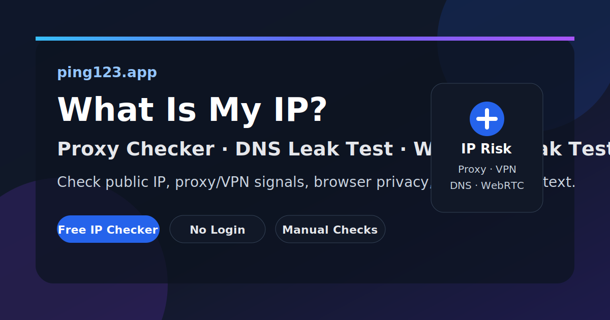

# What Is My IP Address? Proxy Checker, DNS Leak Test, WebRTC Leak Test

[](https://ping123.app/what-is-my-ip/?utm_source=github&utm_medium=repo&utm_campaign=ping123-what-is-my-ip-proxy-checker&utm_content=hero_badge)
[](https://ping123.app/proxy-check/?utm_source=github&utm_medium=repo&utm_campaign=ping123-what-is-my-ip-proxy-checker&utm_content=hero_badge)
[](https://ping123.app/en/dns-leak-test/?utm_source=github&utm_medium=repo&utm_campaign=ping123-what-is-my-ip-proxy-checker&utm_content=hero_badge)
[](LICENSE)

Ping123 is a free browser-based IP checker for answering **what is my IP address**, checking whether a **proxy or VPN** route is active, and reviewing **DNS leak**, **WebRTC leak**, **IP risk score**, and browser privacy signals.

> Fast path: open the live checker at  
> https://ping123.app/what-is-my-ip/?utm_source=github&utm_medium=repo&utm_campaign=ping123-what-is-my-ip-proxy-checker&utm_content=hero_cta



## Table of Contents

- [Start Here](#start-here)
- [What Ping123 Checks](#what-ping123-checks)
- [Free IP and Privacy Tools](#free-ip-and-privacy-tools)
- [Copyable Proxy and VPN Checklist](#copyable-proxy-and-vpn-checklist)
- [Ping123 vs Basic IP Checker Sites](#ping123-vs-basic-ip-checker-sites)
- [Use Cases](#use-cases)
- [Docs](#docs)
- [FAQ](#faq)

## Start Here

Use this repository as a practical reference page for checking:

- **What is my IP address?**
- **Is my proxy working?**
- **Is my VPN leaking DNS or WebRTC signals?**
- **Does my IP address have risk or reputation signals?**
- **Do my browser language, time zone, DNS, and WebRTC signals match my visible IP?**

Open the main Ping123 IP checker:

https://ping123.app/what-is-my-ip/?utm_source=github&utm_medium=repo&utm_campaign=ping123-what-is-my-ip-proxy-checker&utm_content=start_here

## What Ping123 Checks

Ping123 combines network and browser diagnostics in one manual workflow:

| Signal | Why it matters |
|---|---|
| Public IP address | The IP address websites see when your browser connects |
| IP location | Country and region context for the visible network route |
| ASN, ISP, organization | Helps identify residential, mobile, business, hosting, or datacenter networks |
| Proxy checker signals | Indicates whether the route may appear as proxy infrastructure |
| VPN detection signals | Helps verify whether a VPN exit is active or visible |
| DNS leak behavior | Reveals whether DNS routing matches the expected proxy or VPN path |
| WebRTC leak behavior | Checks browser-side network exposure that can differ from the main IP |
| IP risk score | Summarizes reputation, proxy, VPN, hosting, and abuse-risk context |
| Browser context | User agent, language, time zone, and other coherence signals |

## Free IP and Privacy Tools

| Tool | Target keyword | Live page |
|---|---|---|
| What Is My IP | `what is my ip`, `my ip address`, `ip checker` | https://ping123.app/what-is-my-ip/?utm_source=github&utm_medium=repo&utm_campaign=ping123-what-is-my-ip-proxy-checker&utm_content=tool_table |
| Proxy Checker | `proxy checker`, `check proxy`, `is my proxy working` | https://ping123.app/proxy-check/?utm_source=github&utm_medium=repo&utm_campaign=ping123-what-is-my-ip-proxy-checker&utm_content=tool_table |
| IP Risk Score | `ip risk score`, `ip risk checker`, `ip reputation` | https://ping123.app/ip-risk/?utm_source=github&utm_medium=repo&utm_campaign=ping123-what-is-my-ip-proxy-checker&utm_content=tool_table |
| DNS Leak Test | `dns leak test`, `vpn dns leak`, `dns leak checker` | https://ping123.app/en/dns-leak-test/?utm_source=github&utm_medium=repo&utm_campaign=ping123-what-is-my-ip-proxy-checker&utm_content=tool_table |
| WebRTC Leak Test | `webrtc leak test`, `browser webrtc leak`, `webrtc ip leak` | https://ping123.app/en/webrtc-leak-test/?utm_source=github&utm_medium=repo&utm_campaign=ping123-what-is-my-ip-proxy-checker&utm_content=tool_table |
| VPN Leak Checklist | `vpn leak test`, `vpn ip check`, `vpn detection` | https://ping123.app/vpn-detection/?utm_source=github&utm_medium=repo&utm_campaign=ping123-what-is-my-ip-proxy-checker&utm_content=tool_table |

## Copyable Proxy and VPN Checklist

Use this quick checklist before relying on a proxy, VPN, browser profile, QA session, or network test:

```text
Ping123 proxy/VPN check

[ ] Public IP changed to the expected route
[ ] IP country and region match the intended environment
[ ] ASN, ISP, and organization look expected
[ ] Proxy/VPN/datacenter/risk labels are understood
[ ] DNS leak test does not reveal an unexpected resolver path
[ ] WebRTC leak test does not expose unexpected network information
[ ] Browser language and time zone match the visible IP context
[ ] Result was re-tested after browser, VPN, proxy, DNS, or extension changes
```

Full checklist:

https://ping123.app/vpn-leak-test-checklist/?utm_source=github&utm_medium=repo&utm_campaign=ping123-what-is-my-ip-proxy-checker&utm_content=checklist

## Ping123 vs Basic IP Checker Sites

| Feature | Basic IP checker | Ping123 |
|---|---:|---:|
| Shows public IP address | Yes | Yes |
| IP location context | Sometimes | Yes |
| ASN, ISP, organization context | Sometimes | Yes |
| Proxy checker workflow | Rarely | Yes |
| VPN detection workflow | Rarely | Yes |
| DNS leak test workflow | Rarely | Yes |
| WebRTC leak test workflow | Rarely | Yes |
| IP risk score context | Rarely | Yes |
| Browser privacy context | Rarely | Yes |
| Manual troubleshooting checklist | No | Yes |

## Use Cases

### Check What IP Websites See

Use Ping123 to confirm your public IP address after switching networks, enabling a VPN, changing a proxy endpoint, or moving between desktop, mobile, Wi-Fi, and mobile data.

### Check If a Proxy Is Working

Connect to your proxy, open Ping123, and compare the visible IP, country, ASN, ISP, DNS, WebRTC, and risk signals with the route you expected.

Proxy checker:

https://ping123.app/proxy-check/?utm_source=github&utm_medium=repo&utm_campaign=ping123-what-is-my-ip-proxy-checker&utm_content=proxy_section

### Run a DNS Leak Test

A DNS leak can happen when DNS requests are routed outside the expected VPN or proxy path. Ping123 helps compare resolver behavior against the visible public IP.

DNS leak test:

https://ping123.app/en/dns-leak-test/?utm_source=github&utm_medium=repo&utm_campaign=ping123-what-is-my-ip-proxy-checker&utm_content=dns_section

### Run a WebRTC Leak Test

WebRTC behavior can expose unexpected browser-side network information. Re-test after browser updates, VPN updates, extension changes, or profile changes.

WebRTC leak test:

https://ping123.app/en/webrtc-leak-test/?utm_source=github&utm_medium=repo&utm_campaign=ping123-what-is-my-ip-proxy-checker&utm_content=webrtc_section

### Review IP Risk Before Sensitive Workflows

Trust and safety teams, QA engineers, developers, and privacy-conscious users can review IP risk context before testing location-sensitive flows, authentication flows, access controls, or network changes.

IP risk score:

https://ping123.app/ip-risk/?utm_source=github&utm_medium=repo&utm_campaign=ping123-what-is-my-ip-proxy-checker&utm_content=risk_section

## Docs

This repository includes short, shareable references:

- [Docs index](docs/README.md)
- [Proxy and VPN leak test checklist](docs/proxy-vpn-leak-test-checklist.md)
- [IP risk signals explained](docs/ip-risk-signals.md)
- [Browser privacy signals](docs/browser-privacy-signals.md)
- [FAQ](docs/faq.md)

## FAQ

### What is my IP address?

Your public IP address is the address websites see when your browser connects to them. It can reveal your visible network route, approximate location, ASN, ISP, organization, or network type.

### How do I check if my proxy is working?

Open Ping123 while connected to the proxy. Check whether the visible IP, location, ASN, DNS behavior, WebRTC behavior, and proxy indicators match what you expected.

### Can a VPN leak my real IP address?

Yes. VPN setups can still expose mismatched DNS, WebRTC, browser, time zone, or routing signals. Ping123 helps you manually inspect those signals.

### What is a DNS leak test?

A DNS leak test checks whether DNS requests are routed through the expected resolver path. Unexpected DNS behavior can reveal network information that does not match the visible public IP.

### What is a WebRTC leak test?

A WebRTC leak test checks whether browser WebRTC behavior exposes unexpected network information. It is especially useful after browser, extension, VPN, proxy, or OS updates.

### What is an IP risk score?

An IP risk score summarizes reputation and network indicators such as proxy or VPN classification, datacenter signals, hosting ranges, abuse patterns, or suspicious infrastructure context.

## Related Ping123 GitHub Repositories

This repository is the main Ping123 GitHub hub. The first-wave keyword matrix is:

- `ping123-what-is-my-ip-proxy-checker`
- `ping123-ip-risk-score-checker`
- `ping123-ip-quality-score-checker`
- `ping123-ip-fraud-score-checker`
- `ping123-ip-reputation-checker`
- `ping123-dns-webrtc-vpn-leak-test`

## License

MIT
